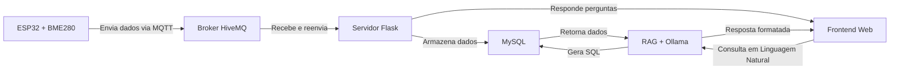

# Projeto de Monitoramento Ambiental com ESP32, MQTT e IA

## Descrição do Projeto

Este projeto está sendo desenvolvido como Trabalho de Conclusão de Curso e consiste em um sistema completo de monitoramento ambiental que coleta dados de um sensor (temperatura, umidade, pressão atmosférica e ponto de orvalho) através de um microcontrolador ESP32, transmite os dados via protocolo MQTT para um servidor Flask utilizando o broker HiveMQ como o intermediário, armazena em um banco de dados MySQL e disponibiliza uma interface web com dashboard e assistente de IA para consulta dos dados.

## Funcionalidades Principais

- **Coleta de dados ambientais** via ESP32
- **Transmissão segura** dos dados usando protocolo MQTT com TLS
- **Armazenamento** histórico em banco de dados MySQL
- **Interface web** com visualização dos dados mais recentes
- **Sistema de perguntas e respostas** utilizando RAG para consultas inteligentes aos dados
- **Geração automática de consultas SQL** base

## Tecnologias Utilizadas

### Hardware

- Microcontrolador ESP32
- Sensor BME280 (temperatura, umidade, pressão)
- Breadboard e componentes eletrônicos

### Software e Infraestrutura

- **Coleta**: C++ (Arduino) + MQTT
- **Broker**: HiveMQ (Servidor MQTT)
- **Backend**: Python (Flask + Flask-MQTT)
- **Banco de Dados**: MySQL
- **Processamento**: RAG (Haystack + Ollama/Mistral)
- **Frontend**: HTML/CSS/JavaScript + Bootstrap

## Diagrama do sistema



## Como usar

### 1. Configuração

Crie um arquivo `.env` na pasta do projeto com:

```py
# Configuração MQTT
HOST="seu_broker_mqtt"
CLIENT_NAME="usuario"
PASSWORD="senha"
TOPIC="topico_dados"

# Configuração MySQL
DB_HOST="localhost"
DB_USER="usuario"
DB_PASSWORD="senha"
DB_NAME="clima_db"
```

### 2. Instalação

```py
pip install -r requirements.txt  # Instala dependências Python
```

### 3. Execução

```py
python mqtt_server.py #Inicia o servidor Flask
```

Acesse http://localhost:5000
